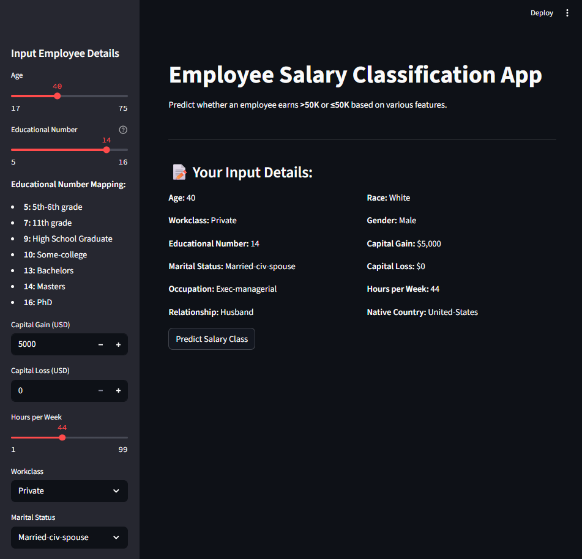
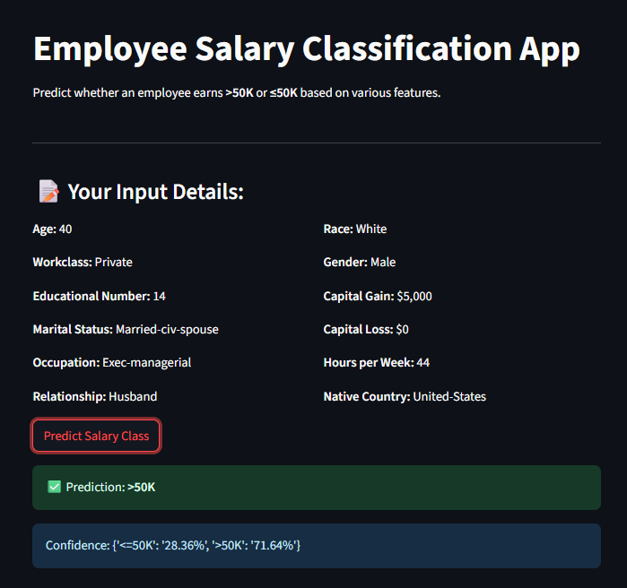

# 💼 Employee Salary Prediction App

This project develops and deploys a machine learning model to predict whether an individual's annual income is greater than $50,000 (`>50K`) or less than or equal to $50,000 (`<=50K`). The prediction is based on various demographic and employment-related features from the Adult Income dataset. A user-friendly web application built with Streamlit allows for interactive predictions.

## ✨ Key Features

* **Interactive Web Interface:** A Streamlit application (`app.py`) provides a clean and intuitive interface for real-time income predictions.
* **User-Friendly Inputs:** Simplified input fields with clear explanations for relevant employee attributes.
* **Confidence Score:** Displays the model's probability for both income classes, offering insight into the prediction's certainty.
* **Robust Preprocessing Pipeline:** Integrates all necessary data cleaning, transformation, and encoding steps, ensuring consistency between training and prediction.
* **Gradient Boosting Classifier:** Utilizes a powerful ensemble model known for its accuracy in classification tasks.

## 🚀 Demo

Below are visual demonstrations of the running Streamlit application.

**Main Application Interface**



**Prediction Result with Confidence**


---

## 🛠️ Technologies Used

* **Python:** The core programming language.
* **Pandas:** Essential for data manipulation and analysis.
* **NumPy:** Provides numerical computing capabilities.
* **Scikit-learn:** Used for building and evaluating machine learning models, including preprocessing steps (StandardScaler, LabelEncoder) and the Gradient Boosting Classifier.
* **Streamlit:** For rapidly developing and deploying the interactive web application.
* **Joblib:** For efficient saving and loading of the trained machine learning pipeline.

## ⚙️ Setup and Local Installation

To set up and run this project on your local machine, follow these steps:

1.  **Clone the Repository:**
    Open your terminal or command prompt and clone the project repository:
    ```bash
    git clone [https://github.com/Ashraf-Ali-M/Employee_Salary_Prediction.git]
    cd Employee_Salary_Prediction
    ```

2.  **Install Required Libraries:**
    Ensure you have a `requirements.txt` file in your repository's root directory with the following content:
    ```
    pandas
    numpy
    scikit-learn
    streamlit
    joblib
    ```
    Then, install them using pip:
    ```bash
    pip install -r requirements.txt
    ```

3.  **Train and Save the Model:**
    The `best_model.pkl` file, which contains your trained machine learning pipeline, is essential for the Streamlit app.
    * Open the `employee_salary_prediction.ipynb` (or whatever you named your Jupyter Notebook) in Jupyter Notebook or JupyterLab.
    * **Run all cells in the notebook.** This step trains the model and saves the complete `scikit-learn` `Pipeline` object as `best_model.pkl` in your project's root directory.

## 🚀 Usage

Once the setup is complete and the model is saved:

1.  **Run the Streamlit Application:**
    Navigate to your project's root directory in your terminal (where `app.py` is located) and execute:
    ```bash
    streamlit run app.py
    ```

2.  **Access the App:**
    Your default web browser will automatically open a new tab displaying the Streamlit application (typically at `http://localhost:8501`).

3.  **Make Predictions:**
    * Use the input controls in the sidebar to provide the employee's details.
    * Click the "Predict Salary Class" button to view the predicted income bracket and its associated confidence score.
